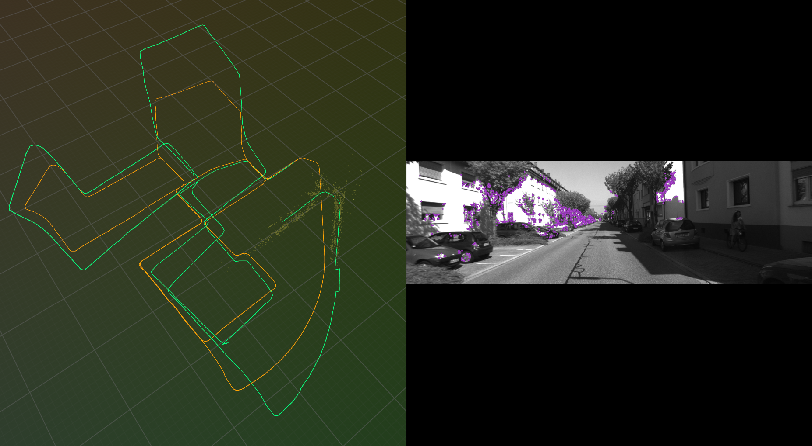

# Stereo Visual SLAM

A ground-up stereo Visual SLAM engine in C++17 and CUDA targeting real-time performance on the KITTI odometry benchmark. Implements the full loop: GPU-accelerated ORB feature matching, metric stereo initialization, constant-velocity tracking with PnP-RANSAC, sliding-window bundle adjustment, pose-graph optimization, and real-time 3D visualization.



*Green: SLAM estimate. Orange: KITTI ground truth. White: active map point cloud.*

---

## Features

- Single-frame stereo triangulation for absolute metric depth (no scale drift)
- Custom CUDA Hamming kernel with warp-shuffle reduction; handles epipolar constraints and ratio test on-device
- Two-phase tracking: projection-based spatial search with GPU Hamming fallback; search radius adapts to predicted rotation
- Ceres SPARSE_SCHUR bundle adjustment with analytical Jacobians, 30-KF sliding window, turn-adaptive Huber loss
- Pose-graph optimization over co-visibility edges, runs every 5 keyframes
- 8-frame coasting, global relocalization (>=30 PnP inliers), map reset with pose propagation on LOST
- Map resets archive keyframes into a persistent trajectory history so the visualization never loses its path
- Real-time 3D visualization via [Rerun 0.22.1](https://rerun.io/)

---

## Architecture

```
+----------------------------------------------------------+
|                        main loop                         |
|   KittiSequence -> Frame  -->  Tracker::track()          |
+--------------------+-------------------------------------+
                     |
           +---------v----------+
           |   Tracker          |
           |  +-------------+  |     GPU
           |  | ORB extract |--+--> cuda_match_stereo_epipolar()
           |  | stereo match|  |     (epipolar + disparity filter)
           |  +------+------+  |
           |         |         |
           |  +------v------+  |
           |  | init/track  |  |
           |  | motion model|  |
           |  | PnP-RANSAC  |  |
           |  +------+------+  |
           +---------+---------+
                     | keyframe?
           +---------v----------+
           |   LocalBA          |   Ceres SPARSE_SCHUR
           |   30-KF window     |   StereoReprojCost (3-residual)
           |   analytical Jac.  |   PitchRollCost (2-residual)
           |   Huber loss       |   PosePriorCost  (6-residual)
           +---------+----------+
                     | every 5 KFs
           +---------v----------+
           |   PoseGraph        |   Ceres SPARSE_NORMAL_CHOLESKY
           |   co-vis edges     |   RelPoseCost (6-residual)
           +---------+----------+
                     |
           +---------v----------+
           |   Visualizer       |   Rerun TCP --> localhost:9876
           +--------------------+
```

---

## How It Works

### 1. Feature Extraction

Each frame extracts up to 2000 ORB keypoints on an 8-level pyramid (scale 1.2x). ORB produces binary 256-bit (32-byte) descriptors, stored as 8 x uint32 on the GPU.

### 2. GPU Hamming Distance Matching

One thread block per query descriptor stripes over the train set in strides of 256, tracking the best and second-best match per thread. Warp-level butterfly reduction packs (dist, idx) into a uint64 for a single min() pass, then thread 0 reduces the 8 warp winners to the final result.

Three variants: nearest-neighbor only, Lowe ratio test (0.75), and stereo epipolar which filters by row distance and disparity range before computing Hamming distance.

### 3. Stereo Initialization

Metric depth from a single stereo frame: `Z = fx * b / d`. No temporal baseline, no scale normalization. The baseline comes from the P1 projection matrix (`b = -P1[3] / fx`, about 0.537 m on KITTI seq 00). Constraints: epipolar row tolerance 2 px, disparity range 3--300 px, depth 0.5--150 m.

### 4. Pose Estimation

Constant-velocity model predicts the next pose, then two-phase matching builds 3D-2D correspondences. Phase 1 projects the local map point pool onto the predicted pose and searches a spatial grid with radius scaling from 40 to 120 px based on predicted rotation angle. Phase 2 falls back to GPU Hamming with ratio test if Phase 1 comes up short.

PnP-RANSAC (SQPNP, 5.5 px threshold, 15 inlier minimum) refines the pose. Sanity checks reject candidates with delta rotation > 0.5 rad or delta translation > 5 m. A project-and-search pass after PnP pulls in additional map points without a second RANSAC.

After bundle adjustment, the velocity is invalidated so the stale inter-KF delta is never used as a prediction.

### 5. Bundle Adjustment

Sliding 30-KF window, Ceres SPARSE_SCHUR, Levenberg-Marquardt, 4 threads, 60 iterations. Three cost terms per keyframe:

- **Stereo reprojection** (3 residuals: u_L, v_L, u_R) with analytical Jacobians derived via chain rule through the skew-symmetric rotation Jacobian
- **Pitch/roll constraint** (2 residuals: R[3] and R[5], both zero when level) with no height reference so there is no drift as the BA window slides
- **Pose prior** (6 residuals) softly anchors each KF to its pre-BA PnP estimate to prevent divergence in low-feature regions

Huber threshold halves at sharp turns (>0.05 rad inter-KF) to downweight distant features. Post-BA: points with >6 px reprojection error or >150 m stereo depth are marked bad.

### 6. Pose Graph Optimization

Every 5 keyframes, co-visibility edges are added between KF pairs outside the local BA window that share at least 15 map points. The edge stores the relative pose measurement `T_AB = T_A_cw * T_B_cw^-1`. An SE(3) log error cost is minimized with SPARSE_NORMAL_CHOLESKY; oldest KF fixed as gauge anchor.

### 7. Keyframe Selection and Triangulation

A new keyframe is inserted when tracked points fall below 80, or the ratio of current tracked to the previous KF's tracked count falls below 0.8. After insertion: multi-baseline triangulation against the last 3 KFs adds map points from unmatched keypoints, then stereo enrichment fills any remaining unmapped keypoints with metric-depth points.

### 8. Relocalization and Recovery

On tracking loss the system coasts for up to 8 frames using the last velocity. If coasting fails, it builds a descriptor pool from the entire map, runs GPU matching, and attempts PnP with a 30-inlier threshold. On failure the map resets: keyframes are archived to a persistent trajectory history, the system reinitializes from the last known pose, and the Rerun path never disappears.

---

## Visualization

Streamed in real time via [Rerun](https://rerun.io/) over TCP to `localhost:9876`.

| Entity path | Type | Update |
|---|---|---|
| `world/camera/image` | Pinhole + Transform3D + Image | Every frame |
| `world/camera/image/keypoints` | Points2D (purple) | Every frame |
| `world/trajectory` | LineStrips3D (green) | Every frame |
| `world/map/points` | Points3D (white) | Every keyframe |
| `world/ground_truth/trajectory` | LineStrips3D (orange) | Once (static) |

The trajectory is rebuilt from the full archive each frame and split into segments at 50 m spatial gaps to handle reinit discontinuities.

---

## Configuration

All tunable parameters live in `Tracker::Config` ([include/slam/tracker.hpp](include/slam/tracker.hpp)) and `LocalBA::Config` / `PoseGraph::Config` in their respective headers.

| Parameter | Value | Effect |
|---|---|---|
| `orb_features` | 2000 | Features per frame |
| `hamming_threshold` | 60 | Max Hamming for valid match |
| `lowe_ratio` | 0.75 | Ratio test threshold |
| `pnp_reprojection` | 5.5 px | RANSAC inlier threshold |
| `pnp_min_inliers` | 15 | Minimum PnP inliers |
| `stereo_epi_tol` | 2.0 px | Epipolar band for stereo match |
| `stereo_d_min` | 3.0 px | Min disparity (~128 m max depth) |
| `stereo_d_max` | 300.0 px | Max disparity (~1.3 m min depth) |
| `kWindowSize` | 30 KFs | Local BA + tracking pool window |
| `huber_delta` | 1.0 px | BA Huber loss threshold |
| `pgo_interval` | 5 KFs | How often PGO runs |
| `min_shared_points` | 15 | Co-visibility edge threshold |

---

## Dependencies

| Dependency | Version | Source |
|---|---|---|
| MSVC | 19.x (VS 2022) | |
| CUDA Toolkit | 12.x | |
| CMake | 3.20+ | |
| OpenCV | 4.x (core, features2d, calib3d, highgui) | vcpkg |
| Ceres Solver | 2.x (eigensparse + schur) | vcpkg |
| Eigen3 | 3.4+ | vcpkg |
| Rerun SDK | 0.22.1 | CMake FetchContent (auto) |

GPU target: Compute Capability 8.6 (RTX 30xx/40xx). Change `CMAKE_CUDA_ARCHITECTURES` in [CMakeLists.txt](CMakeLists.txt) for other cards (e.g. `75` for RTX 20xx, `89` for RTX 40xx).

---

## Build

```bat
:: install vcpkg dependencies
cd C:\Users\<you>\vcpkg
vcpkg install opencv4[core,features2d,calib3d,highgui] --triplet x64-windows
vcpkg install ceres[eigensparse,schur] --triplet x64-windows
vcpkg install eigen3 --triplet x64-windows
vcpkg integrate install

:: configure and build
cmake -B build ^
  -DCMAKE_TOOLCHAIN_FILE=C:/Users/<you>/vcpkg/scripts/buildsystems/vcpkg.cmake ^
  -DCMAKE_BUILD_TYPE=Release
cmake --build build --config Release
```

Rerun SDK is downloaded automatically on first configure.

---

## Dataset Setup

Download [KITTI Odometry](https://www.cvlibs.net/datasets/kitti/eval_odometry.php) and place it under:

```
VSLAM/data/dataset/
  poses/00.txt
  sequences/00/
    calib.txt
    times.txt
    image_0/000000.png ...
    image_1/000000.png ...
```

Stereo mode activates automatically when `image_1/` is present. Without it, the system falls back to monocular initialization with median-depth scale normalization.

---

## Run

```bat
cd C:\...\VSLAM
build\Release\vslam.exe --sequence data/dataset/sequences/00
```

| Flag | Default | Description |
|---|---|---|
| `--sequence <path>` | required | KITTI sequence directory |
| `--start <N>` | 0 | First frame index |
| `--end <N>` | last | Last frame index |
| `--no-viz` | off | Disable Rerun visualization |

Launch Rerun before or alongside SLAM. The viewer connects to `127.0.0.1:9876`.
